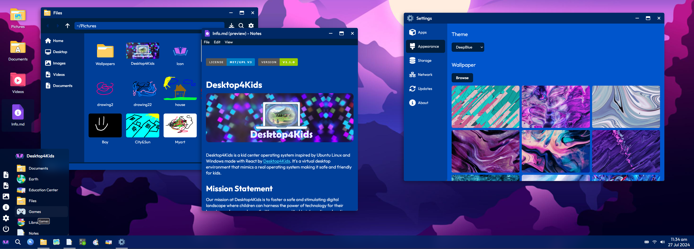

[← Back](../README.md)

# Design

Designed in Figma. You can view the design file [here](https://www.figma.com/file/bEE5RyWgV0QILcXpZWEk2r/ProzillaOS?type=design&node-id=0%3A1&mode=design&t=7KR1tKCp9H5cK3hf-1).

### Preview

## Font

The font used is [Outfit](https://fonts.google.com/specimen/Outfit) from Google Fonts, designed by Smartsheet Inc, Rodrigo Fuenzalida.

## UI Icons

Uses original and modified [Font Awesome](https://fontawesome.com/) icons in its user interface.

## App Icons

The applications use icons that are either modified versions of FontAwesome icons or custom icons.

## Color Palette

The color palette is hand-made by Desktop4Kids and is part of the design file.

## Wallpapers

The wallpapers are generated by https://www.pexels.com/ or generated by Ai.