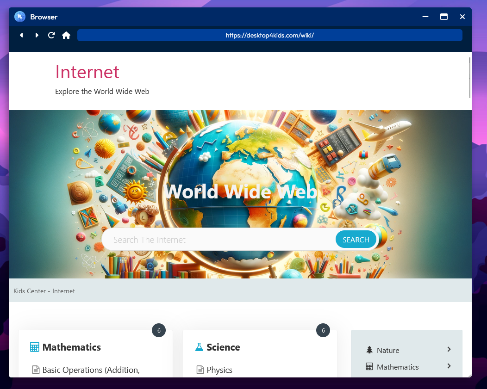

[← Back](../README.md)

#  Browser ("browser")

The Desktop4Kids Browser app. This application is secure and allows kids to view a wide range of information about learning all sorts of information that is usful and secure.

## Screenshot

