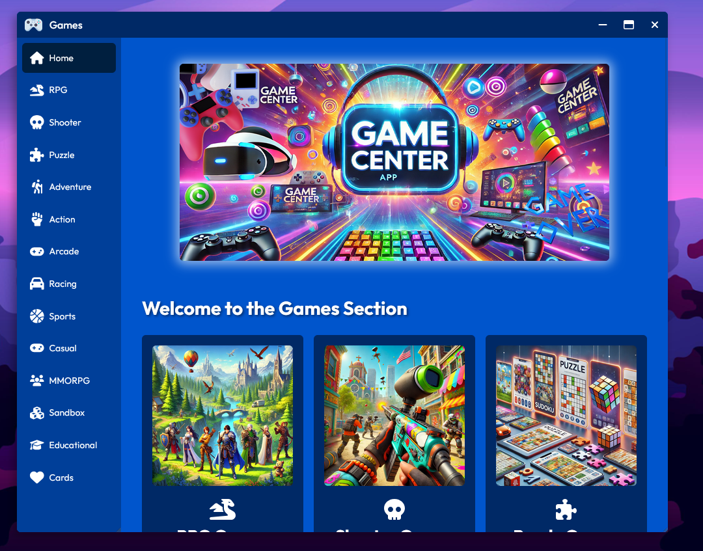

[← Back](../README.md)

#  File Explorer ("Files")

Desktop4Kids' Games section offers a vibrant and user-friendly interface, allowing users to easily navigate through various game categories such as RPG, Shooter, Puzzle, Adventure, Action, Arcade, Racing, Sports, Casual, MMORPG, Sandbox, Educational, and Cards. Each category features engaging and visually appealing icons, ensuring an enjoyable and seamless gaming experience for kids.

## Screenshot

