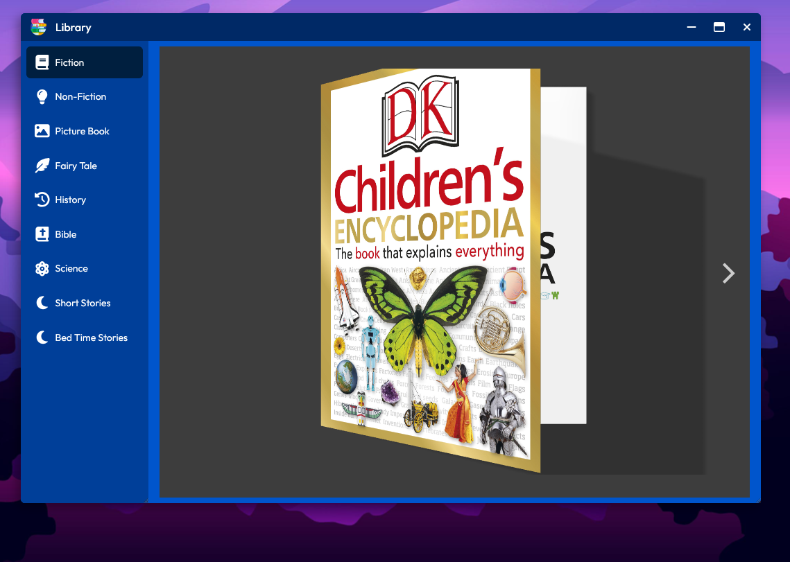

[← Back](../README.md)

#  File Explorer ("Files")

Desktop4Kids Library app is a straightforward virtual book reading platform, offering a wide selection of children's books in a user-friendly digital format. Young readers can easily browse, select, and enjoy their favorite stories with intuitive navigation and engaging visuals, making reading both fun and accessible.

## Screenshot

