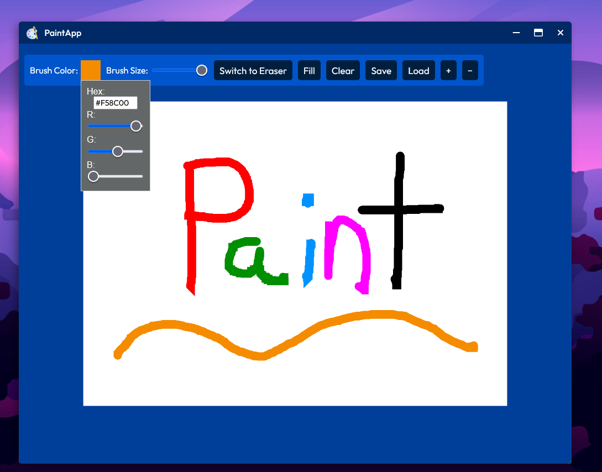

[← Back](../README.md)

#  File Explorer ("Files")

 PaintApp in Desktop4Kids is a fun and interactive drawing tool designed for young artists. With an intuitive interface, kids can easily select brush colors and sizes, switch to the eraser, fill areas with color, clear the canvas, save their artwork, and load previous creations. The app also includes a convenient color picker with hex and RGB sliders, allowing for precise color customization. Perfect for fostering creativity, the PaintApp makes digital drawing engaging and accessible for children.

## Screenshot

