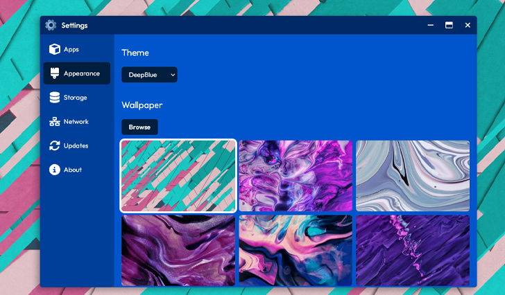

[← Back](../README.md)

#  Settings 

Desktop4Kids OS empowers users to personalize their environment by adjusting settings to suit their preferences. Additionally, users can easily view their storage usage, check for system updates, and monitor the status of their network.

## Screenshot

